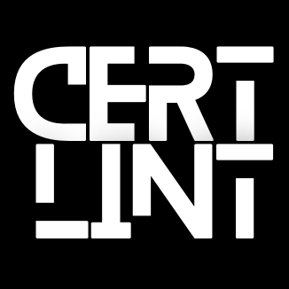

<a name="readme-top"></a>

<!-- PROJECT SHIELDS -->
<!--
*** I'm using markdown "reference style" links for readability.
*** Reference links are enclosed in brackets [ ] instead of parentheses ( ).
*** See the bottom of this document for the declaration of the reference variables
*** for contributors-url, forks-url, etc. This is an optional, concise syntax you may use.
*** https://www.markdownguide.org/basic-syntax/#reference-style-links
-->

<!-- PROJECT LOGO -->
<br />
<div align="center">
  <a href="https://github.com/BobBlank12/certlint">
    
  </a>

<!-- <h3 align="center">CertLint</h3> -->

  <p align="center">
    <br />
    <br />
    CertLint is a tool to help you view/convert/validate your certificates and keys. It can be run online or completely offline in a Docker container.
    <br />
    <br />
    <a href="https://github.com/BobBlank12/certlint">View Demo</a>
    ·
    <a href="https://github.com/BobBlank12/certlint/issues">Report Bug</a>
    ·
    <a href="https://github.com/BobBlank12/certlint/issues">Request Feature</a>
  </p>
</div>

<!-- TABLE OF CONTENTS -->
<details>
  <summary>Table of Contents</summary>
  <ol>
      <li><a href="#about-the-project">About The Project</a></li>
      <li><a href="#prerequisites">Prerequisites</a></li>
      <li><a href="#run-certlint">Run CertLint</a></li>
      <li><a href="#clean-up">Clean Up</a></li>
      <li><a href="#usage">Usage</a></li>
      <li><a href="#roadmap">Roadmap</a></li> 
      <li><a href="#contributing">Contributing</a></li>
      <li><a href="#built-with">Built With</a></li>
      <li><a href="#license">License</a></li>
  </ol>
</details>

<!-- ABOUT THE PROJECT -->
## About The Project
CertLint is a project I built to improve/practice my skills in scripting, CI/CD, Docker and Kubernetes.  **BY NO MEANS** am I claiming/attempting or wanting to be a front-end developer. You can use the online version to "play with" or you can use it "offiline" to convert/validate your own certificates and keys by running it in a Docker container.

[![product-screenshot1][product-screenshot1]](https://github.com/BobBlank12/certlint/)

<br></br>

[![product-screenshot2][product-screenshot2]](https://github.com/BobBlank12/certlint/)

<br></br>

[![product-screenshot3][product-screenshot3]](https://github.com/BobBlank12/certlint/)

<br></br>

[![product-screenshot4][product-screenshot4]](https://github.com/BobBlank12/certlint/)

<br></br>

[![product-screenshot5][product-screenshot5]](https://github.com/BobBlank12/certlint/)

<br></br>


<p align="right">(<a href="#readme-top">back to top</a>)</br></p>

## Prerequisites

**1. Install Docker on your host:** [Install Docker](https://docs.docker.com/get-docker/)

**2. Pull the latest CertLint Docker image from the Docker repository:**
```
docker pull bkblankdocker/certlint:latest
```
At this point, you can disconnect your network connections if you don't trust the container to "phone home" and steal any certificates/keys/passwords you provide.

<p align="right">(<a href="#readme-top">back to top</a>)</br></p>

## Run CertLint
**3. Run the container:**
```
docker run -d -p 5000:5000 --name certlint bkblankdocker/certlint:latest
```

If port 5000 is in use on your host, choose another port of your preference, e.g. use port 9000
```
docker run -d -p 9000:5000 bkblankdocker/certlint:latest
```

**4. Open your browser to http://localhost:5000**

<p align="right">(<a href="#readme-top">back to top</a>)</br></p>

## Clean up

**5. Stop and remove the running certlint container**

Make sure you have saved all of the converted certificates/keys you want as the next step will destory the container and any files it created for you.

```
docker rm -f certlint
```

**6. Remove the certlint docker image from your machine** 
```
docker image rm bkblankdocker/certlint:latest
```

Re-enable your network interfaces if you disabled them above.

<p align="right">(<a href="#readme-top">back to top</a>)</br></p>

<!-- USAGE EXAMPLES -->
## Usage

I may put some examples here... but I hope the tool is self-explanatory.

<p align="right">(<a href="#readme-top">back to top</a>)</br></p>

<!-- ROADMAP -->
## Roadmap

- [ ] Decide if I will actually host this online (e.g. GKE)  for people to use or just support running it in containers locally.
- [*] Allow users to create a new Root and Intermediate CA to sign new certificates
    - [ ] Create/Sign certificates with the CAs from above
- [ ] Validate a private/public key are a valid pair
- [ ] Convert keys to different formats (pkcs1-pkcs8-encrypted/unencrypted)
- [ ] Given a CA chain, validate a certificate can be verified using that chain
- [ ] Include support for PFX and JKS files
- [ ] "Online version" - connect to a service and display the cert/chain in use, build a truststore from the chain  

See the [open issues](https://github.com/BobBlank12/certlint/issues) for a full list of proposed features (and known issues).
<p align="right">(<a href="#readme-top">back to top</a>)</br></p>

<!-- CONTRIBUTING -->
## Contributing

If you have a suggestion that would make this better, please fork the repo and create a pull request. You can also simply open an issue with the tag "enhancement".
Don't forget to give the project a star! Thanks again!

1. Fork the Project
2. Create your Feature Branch (`git checkout -b feature/AmazingFeature`)
3. Commit your Changes (`git commit -m 'Add some AmazingFeature'`)
4. Push to the Branch (`git push origin feature/AmazingFeature`)
5. Open a Pull Request

<p align="right">(<a href="#readme-top">back to top</a>)</br></p>

## Built With

* [![Python][Python]][Python-url]
* [![Flask][Flask]][Flask-url]
* [![Docker][Docker]][Docker-url]
* [![Kubernetes][Kubernetes]][Kubernetes-url]
* [![OpenSSL][OpenSSL]][OpenSSL-url]
* [![Jenkins][Jenkins]][Jenkins-url]

<p align="right">(<a href="#readme-top">back to top</a>)</br></p>

<!-- LICENSE -->
## License

Distributed under the MIT License. See [LICENSE](https://github.com/BobBlank12/certlint/blob/main/LICENSE) for more information.

<p align="right">(<a href="#readme-top">back to top</a>)</br></p>

<!-- MARKDOWN LINKS & IMAGES -->
<!-- https://www.markdownguide.org/basic-syntax/#reference-style-links -->
[contributors-shield]: https://img.shields.io/github/contributors/BobBlank12/certlint.svg?style=for-the-badge
[contributors-url]: https://github.com/BobBlank12/certlint/graphs/contributors
[forks-shield]: https://img.shields.io/github/forks/BobBlank12/certlint.svg?style=for-the-badge
[forks-url]: https://github.com/BobBlank12/certlint/network/members
[stars-shield]: https://img.shields.io/github/stars/BobBlank12/certlint.svg?style=for-the-badge
[stars-url]: https://github.com/BobBlank12/certlint/stargazers
[issues-shield]: https://img.shields.io/github/issues/BobBlank12/certlint.svg?style=for-the-badge
[issues-url]: https://github.com/BobBlank12/certlint/issues
[license-shield]: https://img.shields.io/github/license/BobBlank12/certlint.svg?style=for-the-badge
[license-url]: https://github.com/BobBlank12/certlint/blob/main/LICENSE
[linkedin-shield]: https://img.shields.io/badge/-LinkedIn-black.svg?style=for-the-badge&logo=linkedin&colorB=555
[linkedin-url]: https://linkedin.com/in/bob-blank-62672439
[product-screenshot1]: images/screenshot1.png
[product-screenshot2]: images/screenshot2.png
[product-screenshot3]: images/screenshot3.png
[product-screenshot4]: images/screenshot4.png
[product-screenshot5]: images/screenshot5.png
[Flask]: https://img.shields.io/badge/-Flask-000000?style=for-the-badge&logo=flask&logoColor=white
[Flask-url]: https://flask.palletsprojects.com/
[Python]: https://img.shields.io/badge/Python-3776AB?style=for-the-badge&logo=python&logoColor=white
[Python-url]: https://python.org/
[Docker]: https://img.shields.io/badge/Docker-2496ED?style=for-the-badge&logo=docker&logoColor=white
[Docker-url]: https://docker.com/
[Kubernetes]: https://img.shields.io/badge/Kubernetes-DD0031?style=for-the-badge&logo=kubernetes&logoColor=white
[Kubernetes-url]: https://kubernetes.io/
[OpenSSL]: https://img.shields.io/badge/OpenSSL-721412?style=for-the-badge&logo=openssl&logoColor=white
[OpenSSL-url]: https://www.openssl.org/
[Jenkins]: https://img.shields.io/badge/Jenkins-24939?style=for-the-badge&logo=jenkins&logoColor=white
[Jenkins-url]: https://www.jenkins.io/
